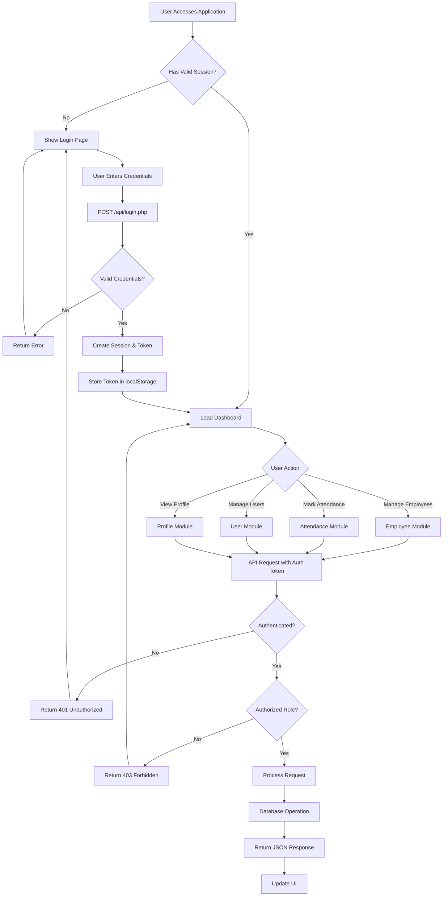
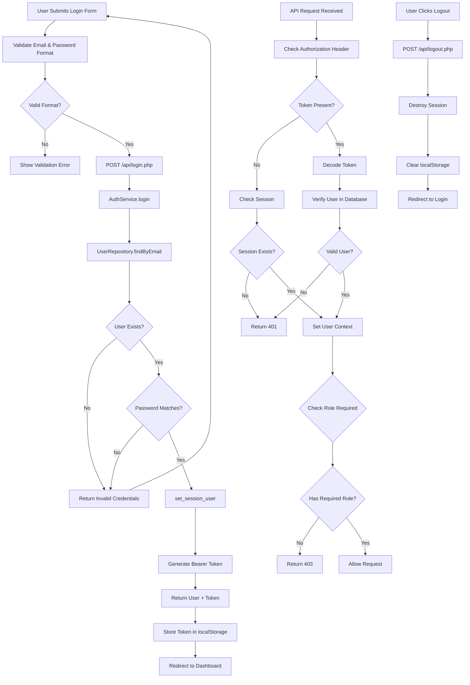
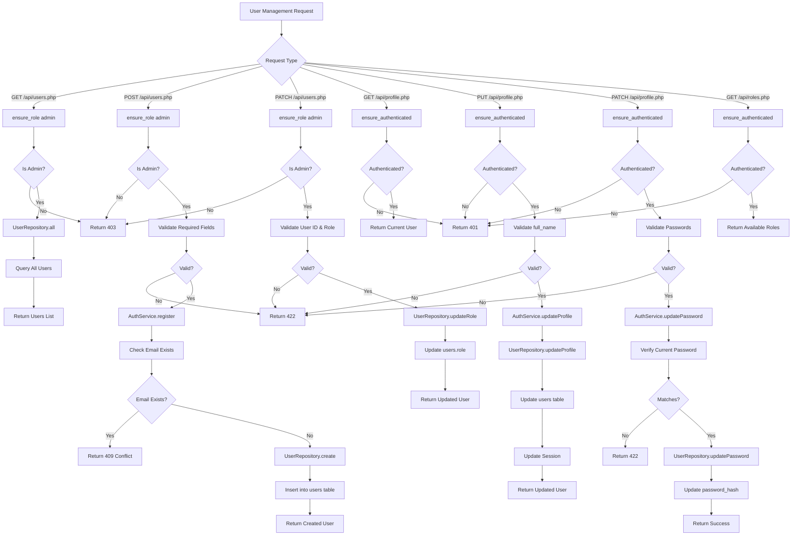
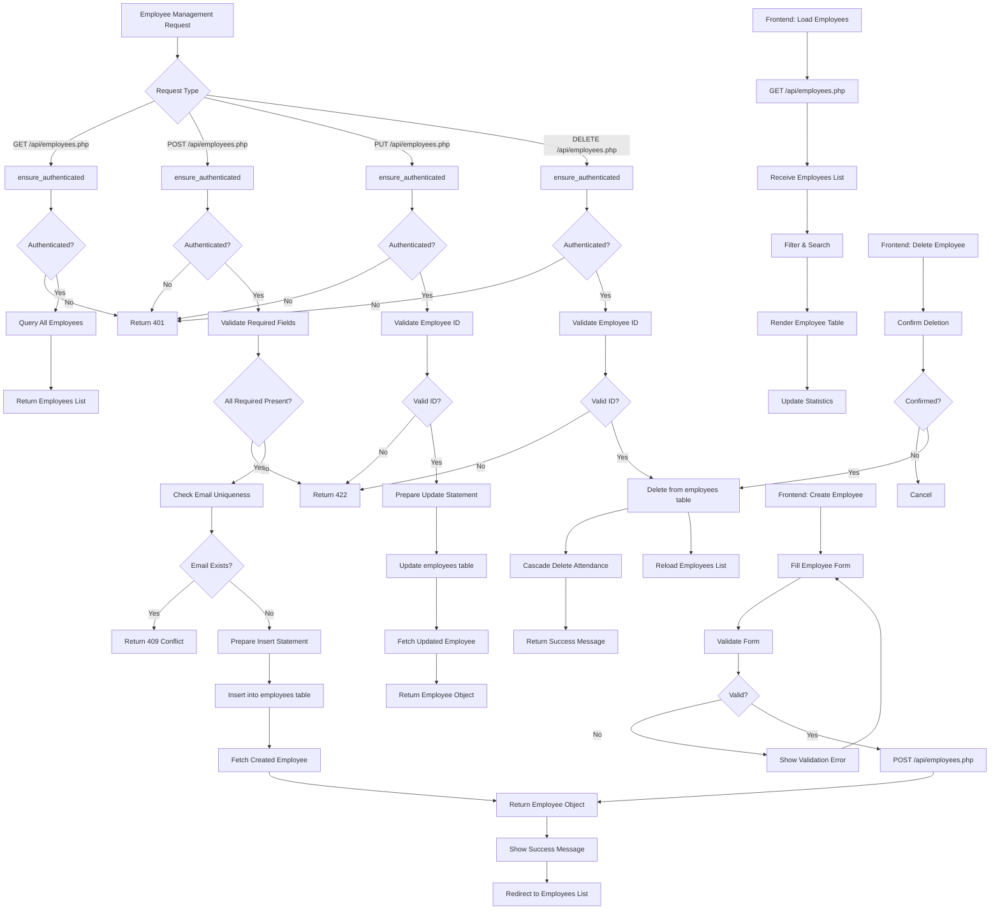
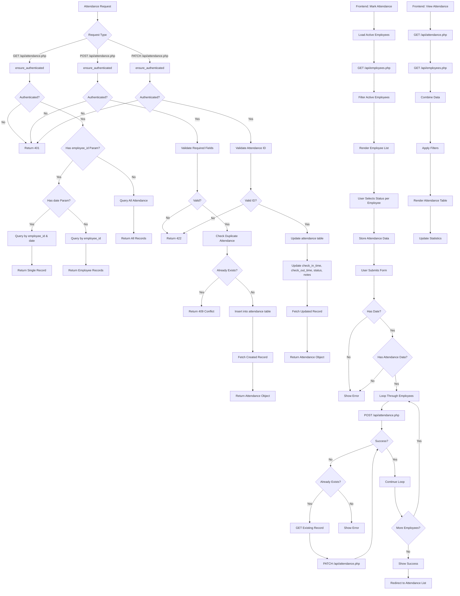
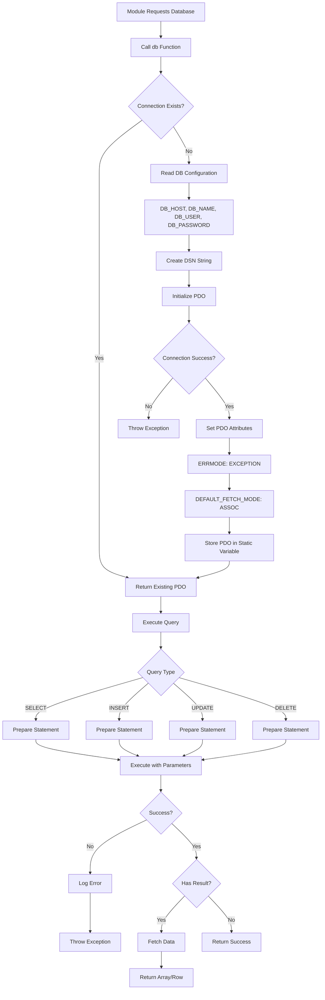
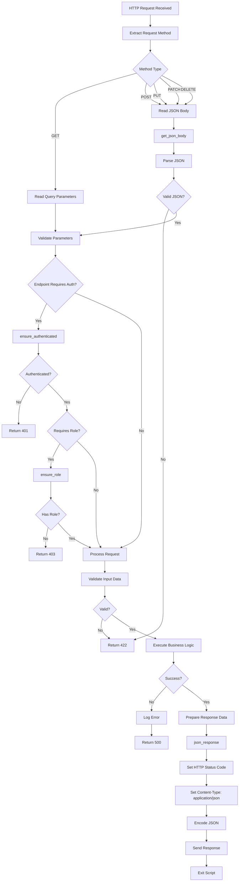
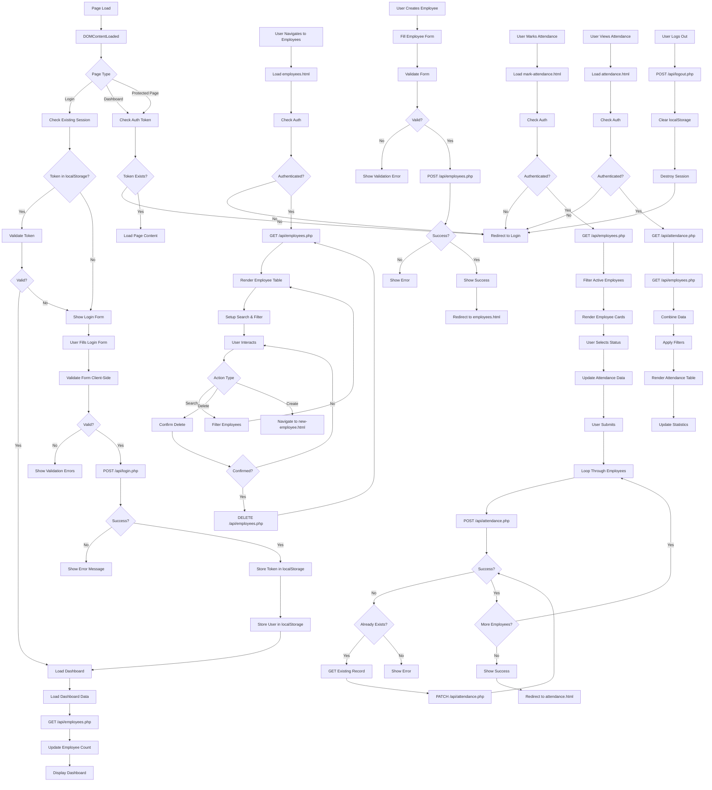
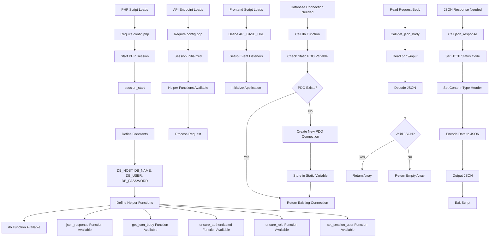

# FLOWS.md

## Overall System Flow

High-level flow showing how users interact with the system from initial access through data persistence.

---

## 1. Authentication & Authorization Module Flow

Handles user login, logout, session validation, and role-based access control.

---

## 2. User Management Module Flow

Manages system users including registration, profile updates, and role management (admin-only operations).

---

## 3. Employee Management Module Flow

Handles employee CRUD operations including creation, listing, updating, and deletion.

---

## 4. Attendance Management Module Flow

Tracks employee attendance with check-in/check-out times, status, and notes.

---

## 5. Database Access Module Flow

Manages database connections, query execution, and error handling.

---

## 6. API Service Layer Module Flow

Handles HTTP requests, routing, validation, and JSON responses.

---

## 7. Frontend UI Module Flow

Manages user interface interactions, form handling, API communication, and state management.

---

## 8. Configuration & Utilities Module Flow

Initializes system configuration, sessions, and provides shared utility functions.

