# FLOW_FIXED.md

## Overall System Flow

High-level view of how users interact with the system.

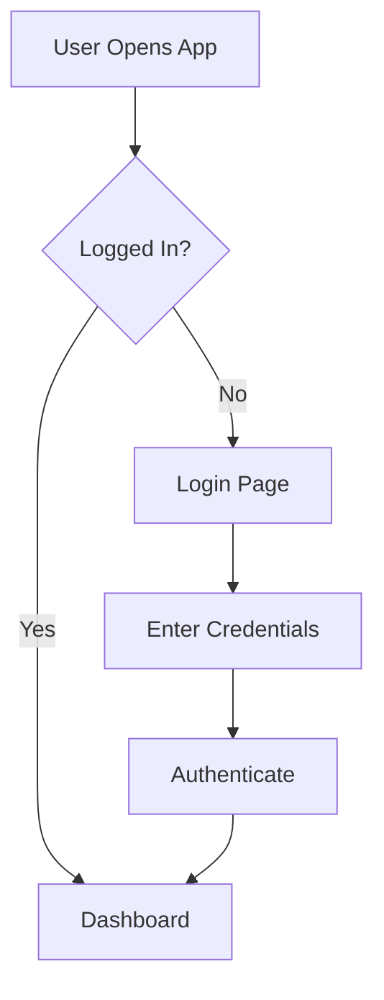
```mermaid
flowchart TD
    A[User Opens App] --> B{Logged In?}
    B -->|No| C[Login Page]
    B -->|Yes| D[Dashboard]
    C --> E[Enter Credentials]
    E --> F[Authenticate]
    F --> D
```

---

## Authentication Flows

### Login Flow

Simple login process from user input to dashboard access.

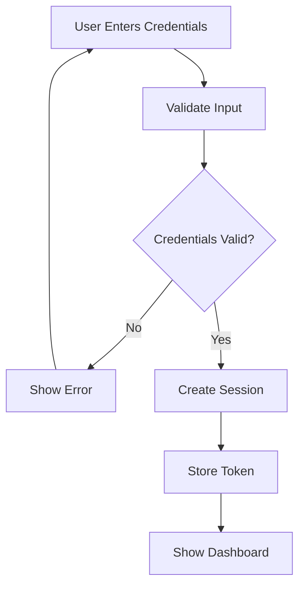
```mermaid
flowchart TD
    A[User Enters Credentials] --> B[Validate Input]
    B --> C{Credentials Valid?}
    C -->|No| D[Show Error]
    C -->|Yes| E[Create Session]
    E --> F[Store Token]
    F --> G[Show Dashboard]
    D --> A
```

### Logout Flow

User logout process.

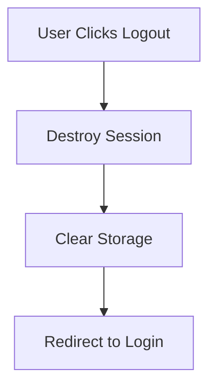
```mermaid
flowchart TD
    A[User Clicks Logout] --> B[Destroy Session]
    B --> C[Clear Storage]
    C --> D[Redirect to Login]
```

### API Authentication Check

How the system verifies authentication for API requests.

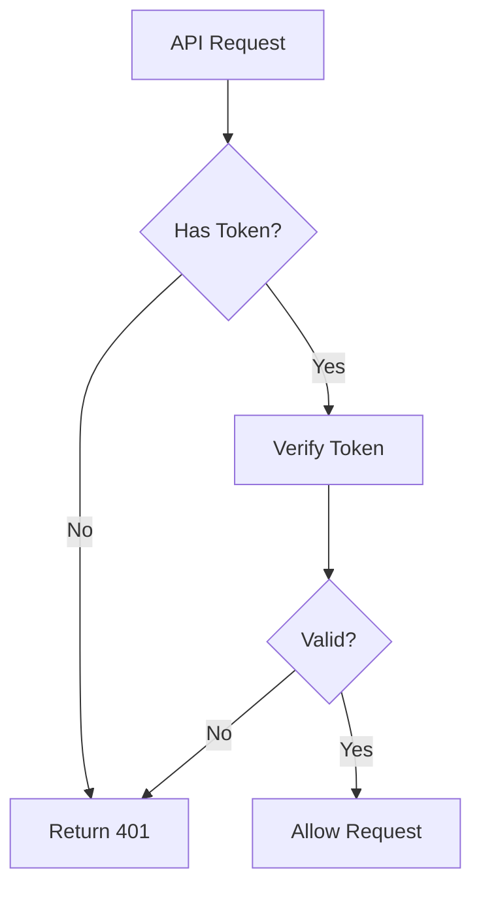
```mermaid
flowchart TD
    A[API Request] --> B{Has Token?}
    B -->|No| C[Return 401]
    B -->|Yes| D[Verify Token]
    D --> E{Valid?}
    E -->|No| C
    E -->|Yes| F[Allow Request]
```

---

## User Management Flows

### View Users (Admin Only)

Admin viewing all system users.

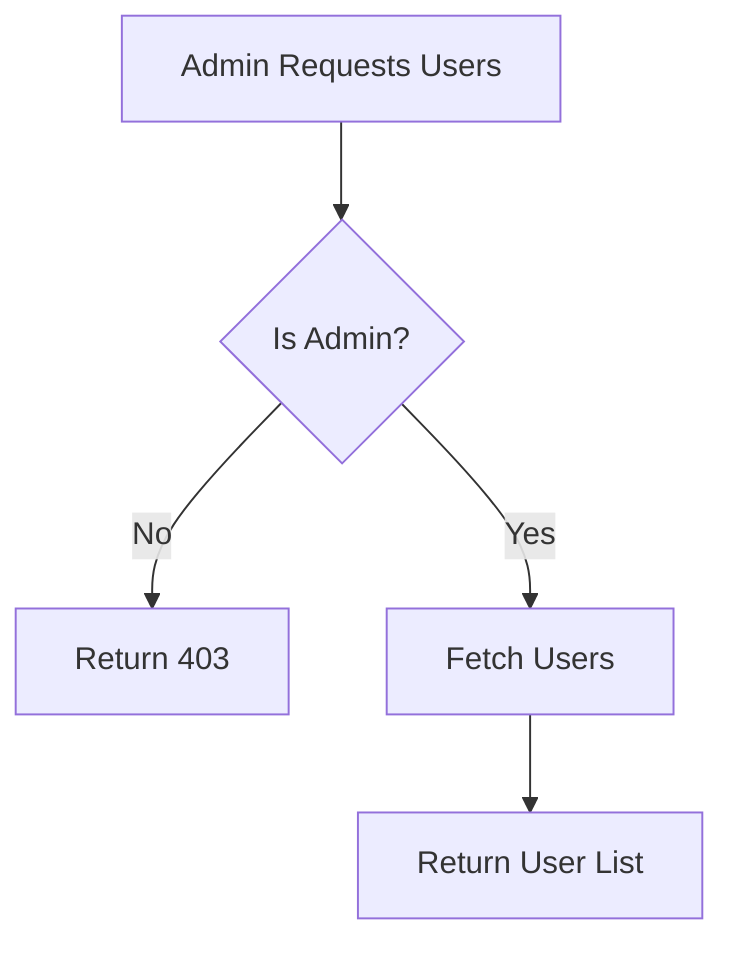
```mermaid
flowchart TD
    A[Admin Requests Users] --> B{Is Admin?}
    B -->|No| C[Return 403]
    B -->|Yes| D[Fetch Users]
    D --> E[Return User List]
```

### Create User (Admin Only)

Admin creating a new user.

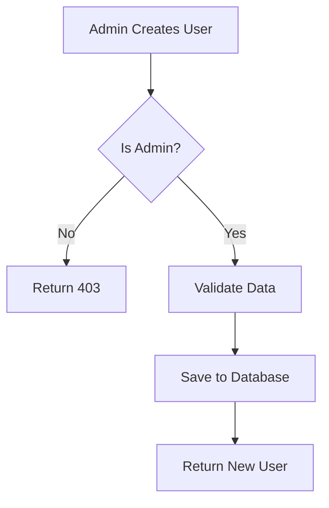
```mermaid
flowchart TD
    A[Admin Creates User] --> B{Is Admin?}
    B -->|No| C[Return 403]
    B -->|Yes| D[Validate Data]
    D --> E[Save to Database]
    E --> F[Return New User]
```

### Update Profile

User updating their own profile.

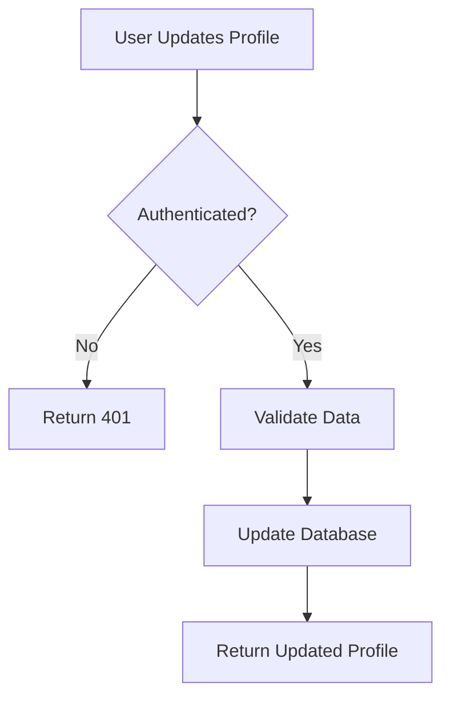
```mermaid
flowchart TD
    A[User Updates Profile] --> B{Authenticated?}
    B -->|No| C[Return 401]
    B -->|Yes| D[Validate Data]
    D --> E[Update Database]
    E --> F[Return Updated Profile]
```

### Change Password

User changing their password.

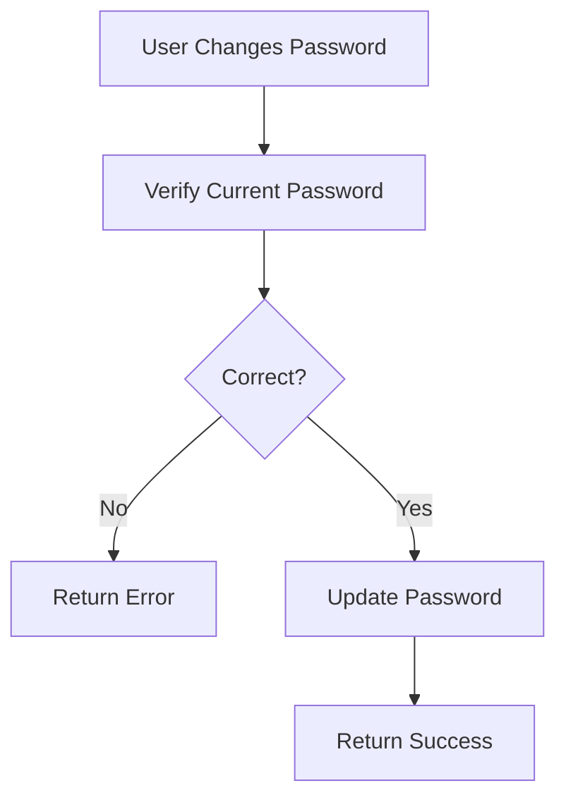
```mermaid
flowchart TD
    A[User Changes Password] --> B[Verify Current Password]
    B --> C{Correct?}
    C -->|No| D[Return Error]
    C -->|Yes| E[Update Password]
    E --> F[Return Success]
```

---

## Employee Management Flows

### View Employees

Viewing the list of all employees.

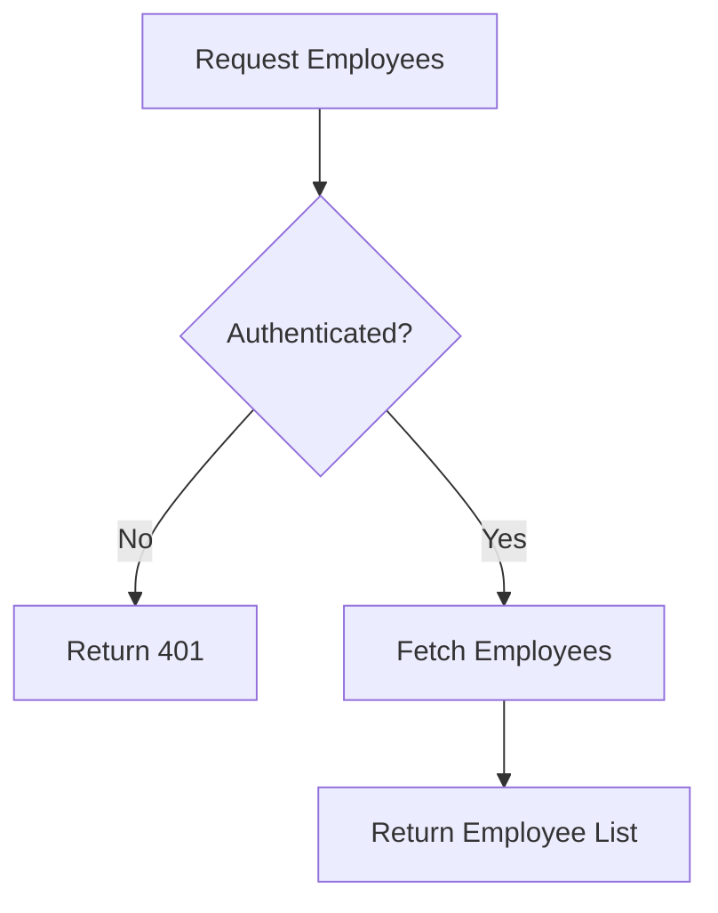
```mermaid
flowchart TD
    A[Request Employees] --> B{Authenticated?}
    B -->|No| C[Return 401]
    B -->|Yes| D[Fetch Employees]
    D --> E[Return Employee List]
```

### Create Employee

Adding a new employee to the system.

```mermaid
flowchart TD
    A[Create Employee] --> B[Validate Data]
    B --> C{Valid?}
    C -->|No| D[Return Error]
    C -->|Yes| E[Save Employee]
    E --> F[Return New Employee]
```

### Update Employee

Modifying employee information.

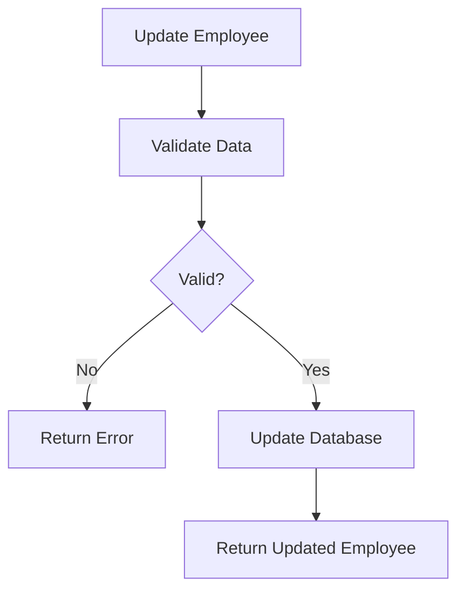
```mermaid
flowchart TD
    A[Update Employee] --> B[Validate Data]
    B --> C{Valid?}
    C -->|No| D[Return Error]
    C -->|Yes| E[Update Database]
    E --> F[Return Updated Employee]
```

### Delete Employee

Removing an employee from the system.

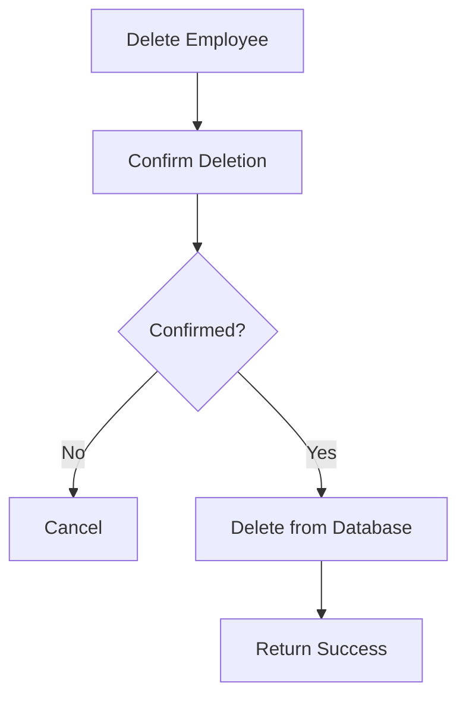
```mermaid
flowchart TD
    A[Delete Employee] --> B[Confirm Deletion]
    B --> C{Confirmed?}
    C -->|No| D[Cancel]
    C -->|Yes| E[Delete from Database]
    E --> F[Return Success]
```

---

## Attendance Management Flows

### View Attendance

Viewing attendance records.

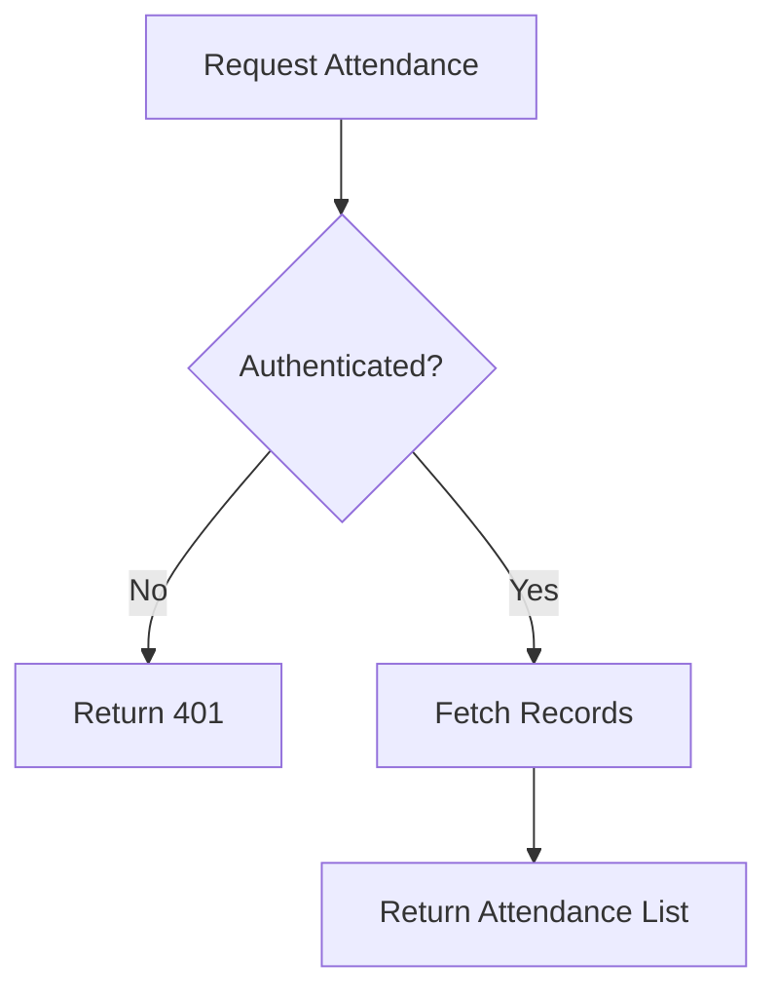
```mermaid
flowchart TD
    A[Request Attendance] --> B{Authenticated?}
    B -->|No| C[Return 401]
    B -->|Yes| D[Fetch Records]
    D --> E[Return Attendance List]
```

### Mark Attendance

Recording attendance for employees.

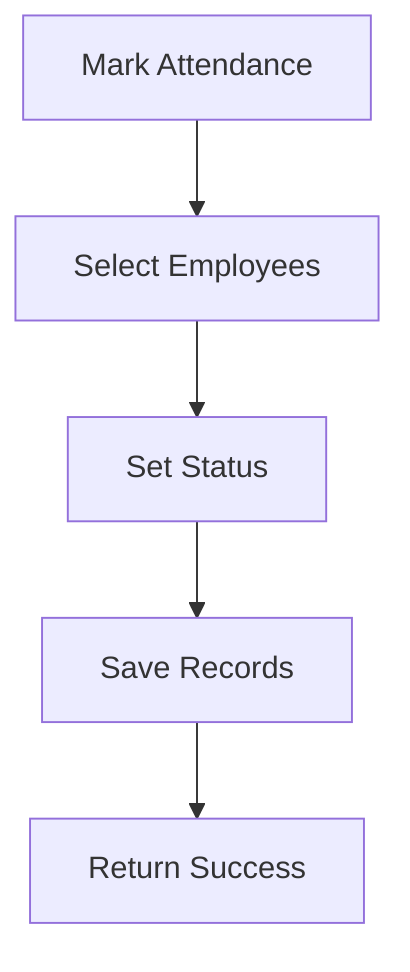
```mermaid
flowchart TD
    A[Mark Attendance] --> B[Select Employees]
    B --> C[Set Status]
    C --> D[Save Records]
    D --> E[Return Success]
```

### Update Attendance

Modifying existing attendance records.

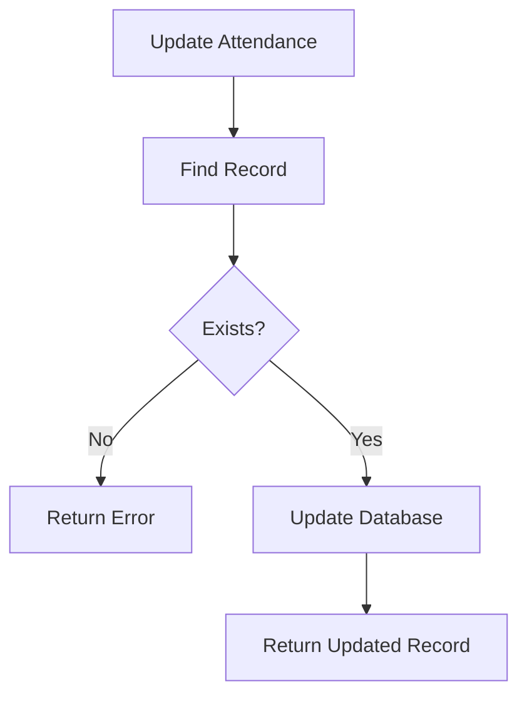
```mermaid
flowchart TD
    A[Update Attendance] --> B[Find Record]
    B --> C{Exists?}
    C -->|No| D[Return Error]
    C -->|Yes| E[Update Database]
    E --> F[Return Updated Record]
```

---

## Frontend Flows

### Page Load Flow

What happens when a page loads.

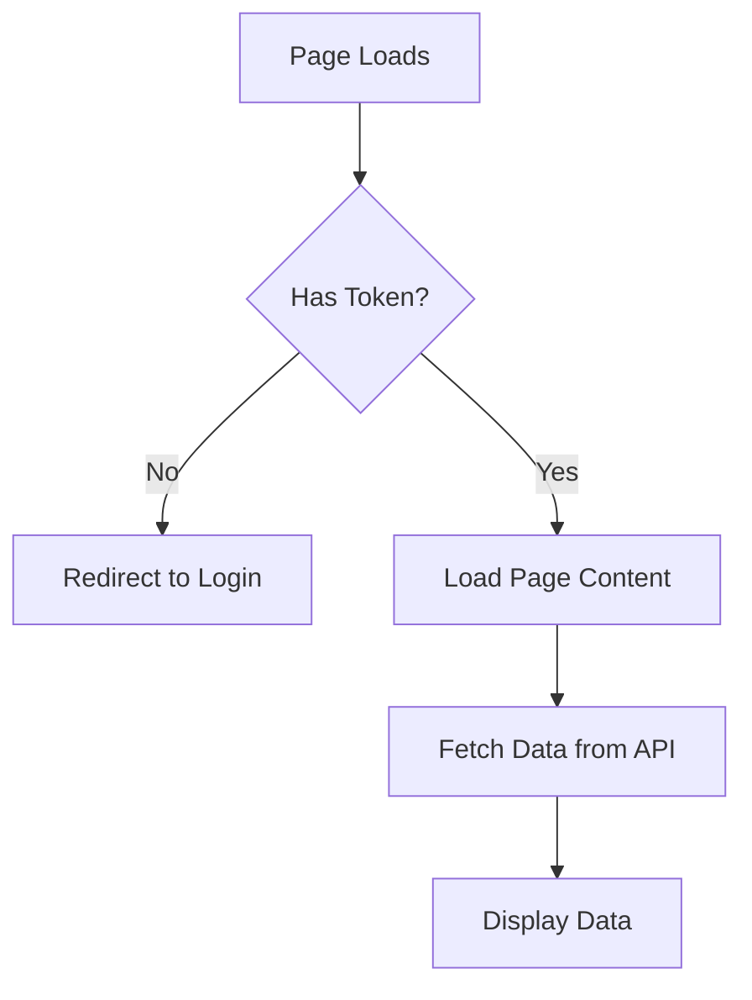
```mermaid
flowchart TD
    A[Page Loads] --> B{Has Token?}
    B -->|No| C[Redirect to Login]
    B -->|Yes| D[Load Page Content]
    D --> E[Fetch Data from API]
    E --> F[Display Data]
```

### Form Submission Flow

How forms are submitted and processed.

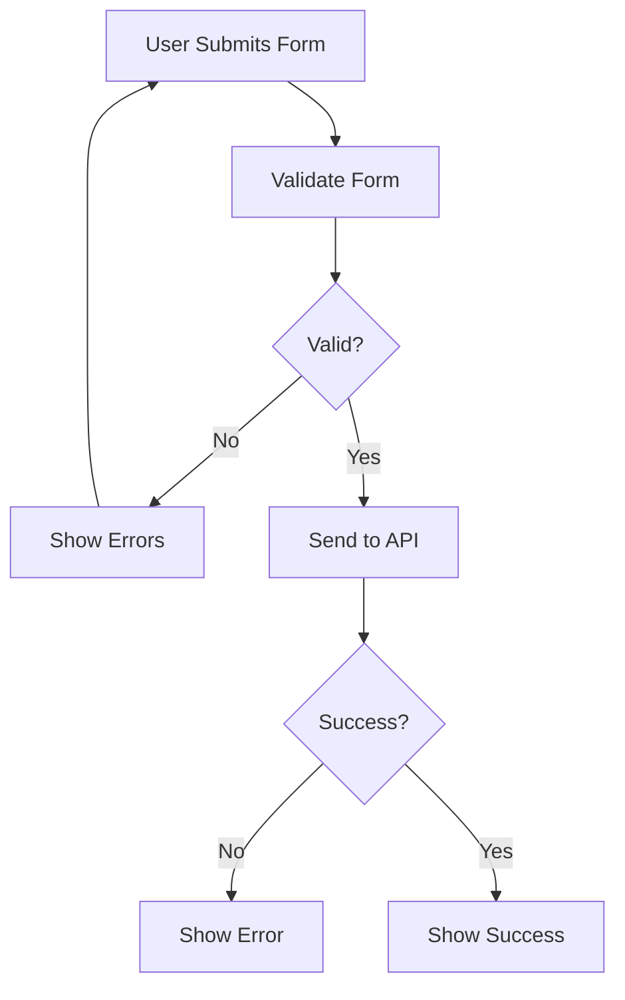
```mermaid
flowchart TD
    A[User Submits Form] --> B[Validate Form]
    B --> C{Valid?}
    C -->|No| D[Show Errors]
    C -->|Yes| E[Send to API]
    E --> F{Success?}
    F -->|No| G[Show Error]
    F -->|Yes| H[Show Success]
    D --> A
```

### Search and Filter Flow

How search and filtering works in the UI.

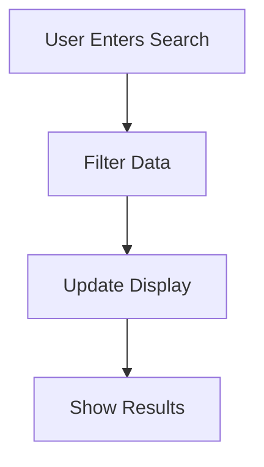
```mermaid
flowchart TD
    A[User Enters Search] --> B[Filter Data]
    B --> C[Update Display]
    C --> D[Show Results]
```

---

## API Request Flow

High-level API request processing.

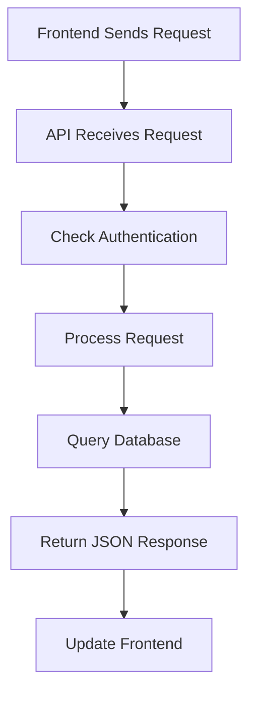
```mermaid
flowchart TD
    A[Frontend Sends Request] --> B[API Receives Request]
    B --> C[Check Authentication]
    C --> D[Process Request]
    D --> E[Query Database]
    E --> F[Return JSON Response]
    F --> G[Update Frontend]
```

---

## Database Flow

How database operations are performed.

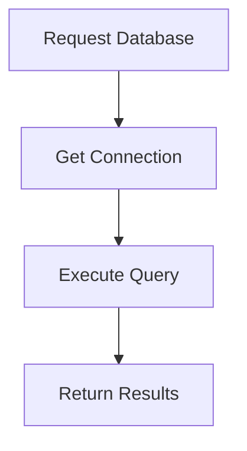
```mermaid
flowchart TD
    A[Request Database] --> B[Get Connection]
    B --> C[Execute Query]
    C --> D[Return Results]
```

---

## Error Handling Flow

How errors are handled throughout the system.

```mermaid
flowchart TD
    A[Error Occurs] --> B{Error Type?}
    B -->|Validation| C[Return 422]
    B -->|Auth| D[Return 401/403]
    B -->|Server| E[Return 500]
    C --> F[Show Error Message]
    D --> F
    E --> F
```

---

## Complete User Journey

End-to-end flow of a typical user session.

```mermaid
flowchart TD
    A[User Opens App] --> B[Login]
    B --> C[Dashboard]
    C --> D{User Action}
    D -->|Employees| E[Manage Employees]
    D -->|Attendance| F[Mark Attendance]
    E --> C
    F --> C
```

